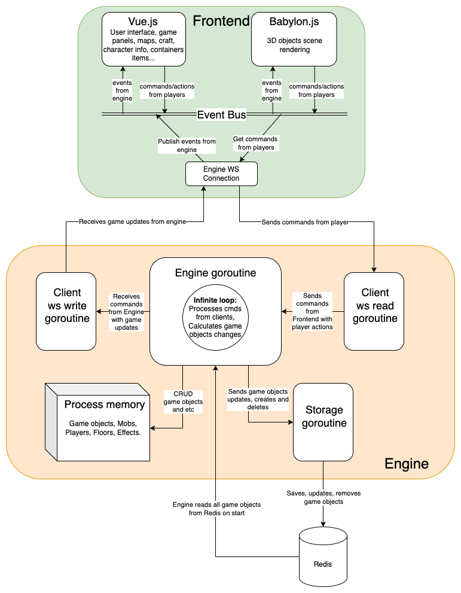
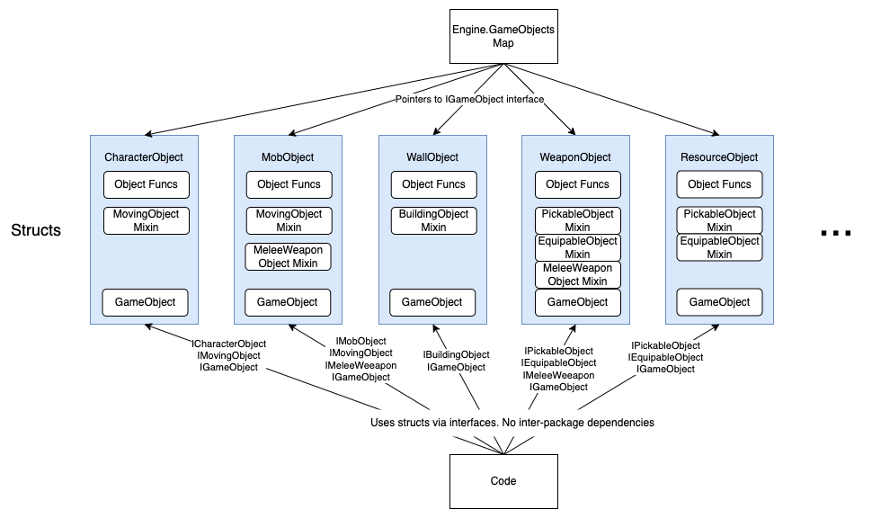
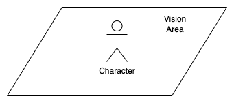
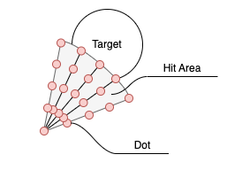

# Reborn MMO RPG Docs

## General information
The project consist of the following main services (you can see them in [docker-compose.yml](../docker-compose.yml) file):
- `api` - [Sinatra](https://sinatrarb.com/) based API for user registration and basic character creation. 
- `engine` - [golang](https://go.dev/) based game engine, which performs all game world calculations and talks with frontend via web sockets.
- `frontend` - [Vue.js](https://vuejs.org/) and [Babylon.js](https://babylonjs.com/) based frontend, which performs HTTP requests to `api` and establishes web sockets communication with `engine`.
- `db` - [PostgreSQL](https://www.postgresql.org/) database to store users. Used by `api`.
- `redis` - [Redis](https://redis.io/) is used to store game objects, so they could survive `engine` restart.
- `chat` - used to implement simple chat between players. Communicates with `frontend` via web sockets.
- `engine_api` - used to provide HTTP API for `engine` in RARE cases it is needed (display image with floor map).
- `caddy` - web gateway.

## Game mechanics
[Game Mechanics Doc](game_mechanics.md)

## Frontend <-> Engine Architecture


## List of commands from Frontend (Players) to Engine
See [engine/pkg/game/engine/process_command.go](../engine/pkg/game/engine/process_command.go)

## List of game updates from Engine to Frontend
- `init_game` - sends a bunch of `add_object` commands when player loads a page with the game.
- `add_object` - instructs frontend to add new game object.
- `add_objects` - same as above, but for multiple objects. Used for better performance in case we need to add many objects.
- `remove_object` - instructs frontend to remove game object.
- `remove_objects` - same as above, but for multiple objects. Used for better performance in case we need to remove many objects.
- `update_object` - instructs frontend to update game object (health, location, etc).
- `add_message` - adds message to chat window. Used to send text explanations of events and errors.
- `character_info` - information about character (equipped items).
- `equip_item` - equip item.
- `unequip_item` - unequip item.
- `pickup_object` - used to inform frontend that character picked up item.
- `npc_trade_info` - information about NPC sell/buy items.
- `craft_atlas` - information about possible craft items.
- `container_items` - list of items in ncontainer.
- `put_item_to_container` - instructs frontend to put item to container.
- `remove_item_from_container` - instructs frontend to remove item to container.
- `select_target` - instrcuts frontend to show that character selected Mob/other character as target.
- `deselect_target` - instrcuts frontend to show that character deselected Mob/other character as target.
- `melee_hit_attempt` - used to inform frontend that there was an attempt of melee hit.
- `start_delayed_action` - used to inform frontend that some time based action has started (like craft).
- `finish_delayed_action` - used to inform frontend that some time based action has finished (like craft).
- `cancel_delayed_action` - used to inform frontend that some time based action was cancelled (like craft).
- `set_exp` - set current experience value for object.
- `set_level` - set current level for object.

## Game Object (GO) Architecture Design

- Engine stores pointers to all Game Objects (GO)
- Each GO is a specific struct, that ALWAYS includes a common GameObject struct inside itself
- Some GOs use Mixins to use shared behaviour like PickableObject
- The rest of the code uses GOs structs via interfaces

### What is a GO?
Any physical thing in the game is a Game Object (GO). A character, a piece of grass/sand/water, a potion, a knife, a tree, a backpack, a mob, a NPC. Everything physical.

Non physical things like effects (healing, for example) are stored inside GO structures.

Every object has common attributes like: Id, X, Y, Width, Height, Type (see [engine/pkg/game/entity/game_object.go](../engine/pkg/game/entity/game_object.go)).

Also GOs are designed as Highly customizable objects, so you can implement any variety of properties, required for all possible GOs. These unique attributes are stored in a hash called `Properties`.

Let's consider the following example:
```json
{
  "axe": {
    "type": "axe",
    "kind": "axe",
    "width": 0.624,
    "height": 1.575,
    "shape": "rectangle",
    "container_id": null,
    "pickable": true,
    "droppable": true,
    "equipable": true,
    "visible": false,
    "target_slots": {
      "left_arm": true, 
      "right_arm": true,
    },
    "actions": {
      "equip": {
      	"cmd": "equip_item",
      	"params": "self",
      },
      "unequip": {
      	"cmd": "unequip_item",
      	"params": "self",
      },
      "drop": {
      	"cmd": "drop_item",
      	"params": "self",
      },
      "pickup": {
      	"cmd": "pickup_item",
      	"params": "self",
      },
    },
  },
}
```
- we duplicate common attributes like `type`, `width`, `height`
- also in runtime `id` is injected into each object
- `shape` is defined here and can be circle or rectangle. Required for collision clculations
- some unique to object attributes are defined here like `container_id`, `target_slots`
- you can see a bunch of properties, which describe the object characteristics like `pickable`, `visible`, `droppable`. They are required for some checks in the code to determine what we can do with the object. FOr example: the player can see only `visible` objects or pickup only `pickable` or bump into `collidable`.
- almost every objects has `actions` - these are commands, which frontend can execute related to this object. `self` in params mean, that the frontend will send the id off the object as parameter.

Design of GO is quite chaotic, honestly. It requires some rethinking in the future.

### GO Atlases
Game Objects description is stored inside so called `atlases`.
They (atlases) are used as a templates to create instances of new game objects.
For example, the player crafted a `stone_knife``. We go to the atlas, find `stone_knife`` template with default properties and create new instance of stone_knife, which we add to player's backpack.

More information about `atlases` can be found [here](atlases.md).

### Special GO attributes
Each GO instance has special attributes for engine based calculations.

For example:
- `CurrentAction` - a timeout based action like craft, which could be canceled. For non player object this could be a hatching action for a dragon hatchery.
- `Effects` - a map of effects applied to the objects.

### GO Lifecycle
There are at least 2 important things you need to keep in mind when creating/removing/ updating GOs.

1. Make sure you update GO in the Redis storage via `storage.GetClient().Updates <- item.Clone()` or `storage.GetClient().Deletes <- gameObj.Id`
2. Add or remove the GO from a Floor via `Insert` or `FilteredRemove`.

## Floor Architecture design
You can think of Floor as some square or rectangle area, where characters can move. It could be an island, a dungeoun, a cave, etc.

Here are the key points:
- Engine stores an array of Floors (maybe later a map will be used).
- Each Game Object (GO) is placed inside one of the Floors.
- Floors are usually covered with surface GO of 1x1 size (grass, sand, water, etc).
- Floors are used to optimize collision detection calculations. For example: a character cannot move trhough the wall or tree. *PS: collisions are calculated only for GO, which have `collidable` attribute*
- Floors use special structure to store GOs called [QuadTree](https://jimkang.com/quadtreevis/). This allows to minimize the ammount of objects to detec collision with.
- Quadtree is also extensively used to detect, what a character can see by finding collisions between player vision area GO and other GOs.

## Player
Player is represented by 2 Game Objects (GO).
- Character
- Vision Area

*Character* is a real visible GO with health, speed, etc. It has a special property `player_id` to link it to the Player struct in Engine, which has websocket connection.
Also `player_id` is equal to id in the `api` service database, so we know to which user account this character belongs.

*Vision Area* is an invisible object tight to player's character GO. It is a huge rectangle area used to calculate "what the character can see". In other words, all GOs, which collide with this area would be visible.
Vision area moves together with the character.



It has a special property `player_id` to link it to the Player struct in Engine, which has websocket connection.

## Main Engine Functions
Engine instance is passed via interface to almost every function in the game so you could easily create GOs and send different updates to `frontend` from anywhere.

To choose, which send fucntion to use, you should decide:
- who should see the update?
Only one player -> use `SendResponse`. For example: player requested to trade with NPC.
All players -> use `SendResponseToVisionAreas`. For example: player killed a mob.
- what happened? If GO changed -> use `SendGameObjectUpdate`. Everything else -> `SendResponse` or `SendResponseToVisionAreas`

See [engine.go](../engine/pkg/game/engine.go) file comments for more details.

## Melee Hit collision detection


Hit Area of a Game Object is a sector with radius and angle.
Collision detection between sector and other geometry figures is a complex mathematical task.

That is why a trick is used. Instead we take 5 vectors from sector (Hit Area) center to edges. On each vector we take 4 dots. In total we have 21 dots (+1 dot in the center).

Next step is to check if the dot is inside the Target figure (circle or rectangle) - this is a very fast and easy task =)

If any dot is inside the Target figure we consider Hit Area and Target have collision.

## Other engine mechanics
[Engine Mechanics Doc](engine_mechanics.md)
